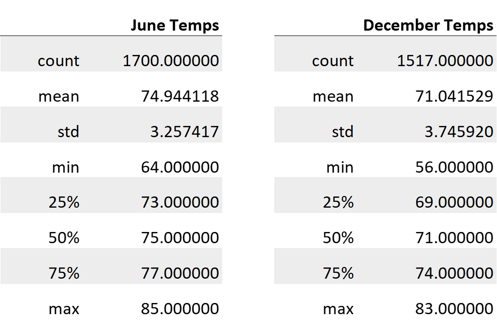

# SURFS UP

## Overview
We are investigating the sustainability of opening a year-round combination surfing and ice cream shop in Oahu.  Part of the analysis is reviewing temperatures in June and December to see how much they vary.  The data was obtained from weather stations on the island and is stored in an SQLite database.  

## Results
•	The mean temperature for June and December were very close, with a difference of less than four degrees.  This indicates a fairly consist daily temperature for Oahu.

•	The maximum temperature for June was 85 degrees and December was 83 degrees, showing that days in the 80’s occur in both months.  In addition, both months having 75% of the readings over 70 degrees.

•	The minimum temperature had a larger difference at eight degrees.  Cooler nights in higher elevations may influence the readings for December.

&nbsp;&nbsp;&nbsp;&nbsp;&nbsp;    

## Summary
Temperature readings seem consistent for the entire year, with a small standard deviation.  The warmer temperatures would be a good point in favor of ice cream and surfing.  There are other areas that could be explored to give a clearer view of the business success.

•	The nine weather stations used to gather temperatures are in various areas of the island.  It would help to focus the analysis on areas that are potential shop locations.  The temperatures and precipitation in the higher elevations may be different enough to skew the data for the beach areas.  It should look at the beaches which are most often visited or researched by tourist.

•	Although Oahu is reported to have the longest recorded rain shower, lasting over 200 days, that should be considered an anomaly for the area.  A rainfall analysis of the beach areas could show how much rain the shop location would receive in a year and show which months normally receive the most precipitation.  This would aid in planning alternative incoming methods (selling umbrellas with the shop logo, providing a larger size ice cream option for take-out or delivery) for the periods of reduced walk-in traffic. 

